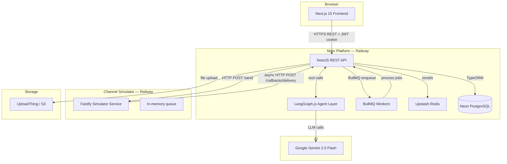
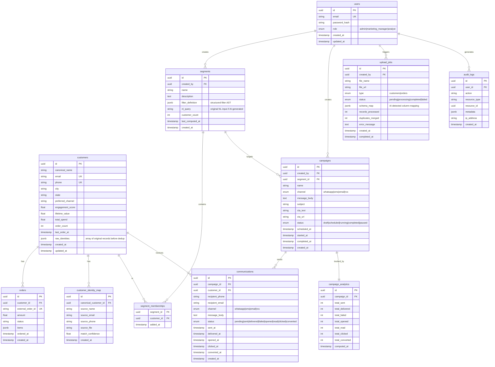
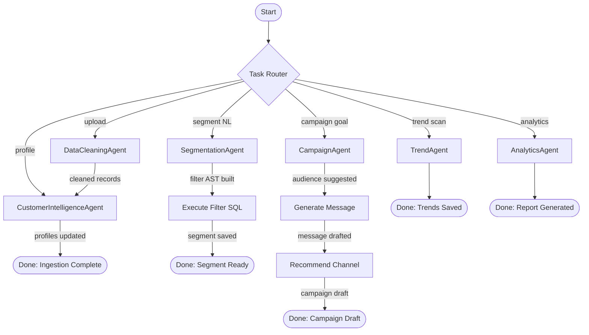
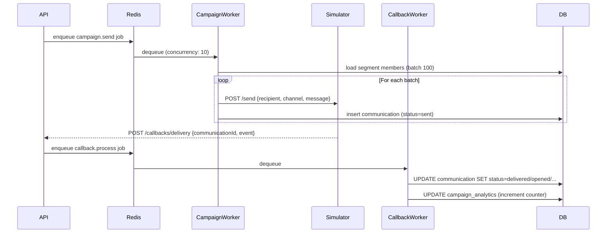
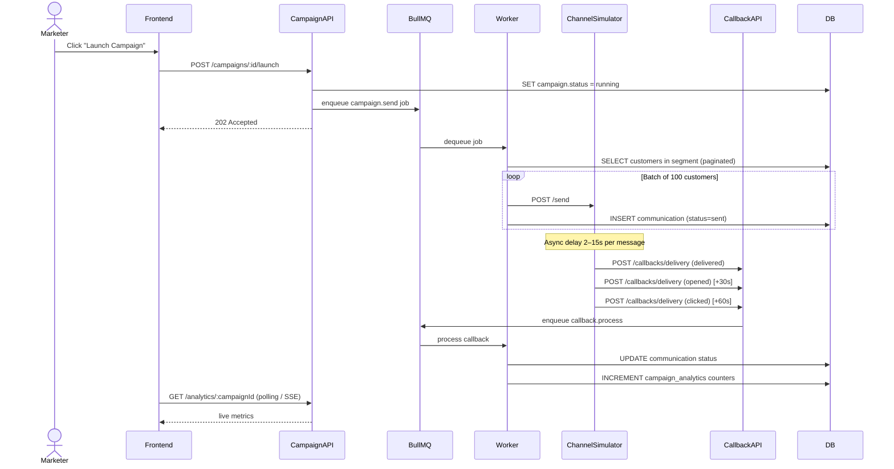

# Arch.md — Customer360 AI CRM
> **Dream Underground CRM** | Architecture Reference Document  
> Version: 1.0 | Status: Approved for Stage 0

---

## 1. System Overview

Customer360 is an AI-native shopper marketing CRM. It is a **two-service system**:

1. **Main Platform** — Next.js 15 frontend + NestJS backend + PostgreSQL + Redis + BullMQ
2. **Channel Simulator** — Standalone Fastify microservice that simulates WhatsApp/SMS/Email/RCS delivery and fires async callbacks back into the main platform

These two services communicate **only** via:
- HTTP POST (CRM → Simulator): send request
- HTTP POST (Simulator → CRM): delivery callback

They share **no database, no Redis, no internal code**.

---

## 2. High-Level Architecture



---

## 3. Detailed Component Architecture

### 3.1 Frontend (Next.js 15)

```
apps/frontend/
├── app/
│   ├── (auth)/           # login, register pages
│   ├── (dashboard)/
│   │   ├── customers/    # Customer 360 views
│   │   ├── segments/     # Audience segmentation
│   │   ├── campaigns/    # Campaign builder + AI generator
│   │   ├── analytics/    # Dashboard + charts
│   │   └── upload/       # Excel/CSV upload
│   └── layout.tsx
├── components/
│   ├── ui/               # ShadCN components
│   ├── charts/           # Recharts wrappers
│   └── agents/           # AI chat interface components
└── lib/
    ├── api.ts            # Typed API client
    └── hooks/            # React Query hooks
```

**Key frontend decisions:**
- All data fetching via React Query (tanstack/query)
- JWT stored in HTTP-only cookie, never localStorage
- File upload uses UploadThing client SDK
- Charts: Recharts for all analytics views

### 3.2 Backend — NestJS

```
apps/backend/
├── src/
│   ├── auth/             # JWT, guards, RBAC decorators
│   ├── customers/        # Customer CRUD + 360 profile
│   ├── orders/           # Order ingestion
│   ├── upload/           # File parsing, schema detection
│   ├── segments/         # Audience segmentation engine
│   ├── campaigns/        # Campaign builder + scheduler
│   ├── callbacks/        # Receives delivery events from Simulator
│   ├── analytics/        # Metrics aggregation
│   ├── agents/           # LangGraph.js agent orchestration
│   ├── queue/            # BullMQ producers + consumers
│   └── common/           # Guards, interceptors, filters
```

### 3.3 Channel Simulator (Fastify)

```
apps/channel-simulator/
├── src/
│   ├── server.ts         # Fastify app entry
│   ├── routes/
│   │   └── send.ts       # POST /send — accepts send requests
│   ├── simulator/
│   │   └── engine.ts     # Probability engine for outcomes
│   └── callback/
│       └── dispatcher.ts # Fires callbacks to CRM
```

The simulator is a **deliberately thin** service. It:
1. Accepts a `POST /send` with `{ recipient, channel, message, campaignId, communicationId }`
2. Queues the item in memory
3. After a randomized delay (2–15s), fires a callback to the CRM at `POST /callbacks/delivery`
4. Fires follow-up events (open, click, convert) staggered over time

**Outcome probability table (configurable per channel):**

| Event | WhatsApp | SMS | Email | RCS |
|---|---|---|---|---|
| Delivered | 92% | 88% | 85% | 90% |
| Failed | 8% | 12% | 15% | 10% |
| Opened | 70% of delivered | 60% | 35% | 65% |
| Clicked | 25% of opened | 15% | 20% | 22% |
| Converted | 8% of clicked | 5% | 6% | 7% |

---

## 4. Database Schema (ERD)



---

## 5. Multi-Agent Architecture (LangGraph.js)

### 5.1 Agent Inventory

| Agent | Trigger | Responsibility |
|---|---|---|
| DataCleaningAgent | File upload | Detect schema, map columns, normalize phone/email, deduplicate |
| CustomerIntelligenceAgent | Post-dedup | Score engagement, compute CLV, detect preferred channel |
| SegmentationAgent | NL query from user | Parse NL → filter AST → execute → return segment |
| CampaignAgent | User prompt "bring back inactive users" | Suggest audience + message + channel + CTA |
| TrendAgent | Daily cron (midnight) | Scan industry signals, generate trend insights |
| AnalyticsAgent | Post-campaign completion | Summarize performance, suggest improvements |

### 5.2 Shared State Schema

```typescript
interface CRMAgentState {
  // Input context
  userId: string;
  tenantId: string;
  task: 'clean' | 'profile' | 'segment' | 'campaign' | 'trend' | 'analytics';

  // Data cleaning
  rawFileUrl?: string;
  detectedSchema?: Record<string, string>;
  cleanedRecords?: CustomerRecord[];
  duplicateGroups?: DuplicateGroup[];

  // Segmentation
  nlQuery?: string;
  filterAST?: FilterNode;
  segmentResult?: { customerIds: string[]; count: number };

  // Campaign generation
  campaignGoal?: string;
  suggestedSegment?: SegmentSuggestion;
  generatedMessage?: GeneratedMessage;

  // Analytics
  campaignId?: string;
  analyticsReport?: AnalyticsReport;

  // Orchestration
  currentAgent: string;
  errors: string[];
  messages: BaseMessage[];
}
```

### 5.3 Agent Workflow Graph



### 5.5 FilterAST Canonical Schema

This is the **single source of truth** for the FilterAST structure used everywhere: agent output, DB storage (`segments.filter_definition`), and the `SegmentExecutor`.

```typescript
// The only valid FilterAST shape — agents MUST output this exactly
interface FilterAST {
  logic: 'AND' | 'OR';
  conditions: FilterCondition[];
}

interface FilterCondition {
  field: string;    // must be in COLUMN_WHITELIST
  op: string;       // must be in SAFE_OPERATORS — key is "op", NOT "operator"
  value: string | number;
}
```

**Example (correct):**
```json
{
  "logic": "AND",
  "conditions": [
    { "field": "totalSpend", "op": "gt", "value": 500 },
    { "field": "city", "op": "eq", "value": "Mumbai" }
  ]
}
```

**Approved field whitelist (`COLUMN_WHITELIST`) — Stage 5:**

| AST `field` | DB column | Type |
|---|---|---|
| `totalSpend` | `c.total_spend` | float |
| `orderCount` | `c.order_count` | int |
| `engagementScore` | `c.engagement_score` | float |
| `city` | `c.city` | string |
| `state` | `c.state` | string |
| `lastOrderAt` | `c.last_order_at` | date (ISO string) |
| `preferredChannel` | `c.preferred_channel` | string |

> **`tags` is NOT in the whitelist.** The `customers` table has no `tags` column. Customer labels (champion/at-risk) are derived at display time from `engagement_score` thresholds. A `tags` column and filter support is deferred to a future migration.

**Approved operator whitelist (`SAFE_OPERATORS`):**

| AST `op` | SQL operator |
|---|---|
| `gt` | `>` |
| `lt` | `<` |
| `gte` | `>=` |
| `lte` | `<=` |
| `eq` | `=` |
| `neq` | `!=` |

Any `field` or `op` not in these whitelists → `BadRequestException` immediately. Never pass through to query builder.

**Route declaration order (NestJS controller):**
`POST /segments/ai-generate` MUST be declared **before** `GET /segments/:id` in the controller to prevent NestJS from matching the string `"ai-generate"` as an `:id` param.


Each agent is a LangGraph.js node:

```typescript
// Example: SegmentationAgent
const segmentationNode = async (state: CRMAgentState) => {
  const llm = new ChatGoogleGenerativeAI({ model: 'gemini-2.0-flash' });
  const tools = [buildFilterASTTool, executeSegmentTool];
  const agent = createReactAgent({ llm, tools });
  const result = await agent.invoke({
    messages: [new HumanMessage(`Convert this to a customer filter: ${state.nlQuery}`)]
  });
  return { ...state, filterAST: extractFilterAST(result), currentAgent: 'segmentation' };
};
```

---

## 6. Queue Architecture (BullMQ)

### 6.1 Queue Inventory

| Queue | Producer | Consumer | Concurrency |
|---|---|---|---|
| `upload.process` | Upload controller | UploadWorker | 2 |
| `campaign.send` | Campaign scheduler | CampaignSendWorker | 10 |
| `callback.process` | Callback controller | CallbackWorker | 20 |
| `analytics.compute` | Campaign completion hook | AnalyticsWorker | 5 |
| `trend.scan` | Daily cron job | TrendWorker | 1 |
| `segment.compute` | Segment save | SegmentWorker | 5 |

### 6.2 Queue Flow Diagram



### 6.3 Retry Strategy

```typescript
// BullMQ job options
const jobOptions = {
  attempts: 3,
  backoff: {
    type: 'exponential',
    delay: 2000,  // 2s, 4s, 8s
  },
  removeOnComplete: { count: 100 },
  removeOnFail: { count: 500 },
};
```

---

## 7. Campaign Send Sequence



---

## 8. Non-Functional Requirements

### 8.1 Scale Targets

| Metric | Target |
|---|---|
| Customers | 100,000 |
| Orders | 1,000,000 |
| Campaign sends/day | 10,000 |
| Concurrent users | 50 |
| API p95 latency | < 300ms |
| File upload processing | < 2 min for 50k rows |

### 8.2 Scaling Strategy

**Database:**
- PostgreSQL indexes on `customers.email`, `customers.phone`, `orders.customer_id`, `orders.ordered_at`, `communications.campaign_id`, `communications.status`
- Partial indexes for active segment queries
- `segment_memberships` computed async via BullMQ, not inline

**Queue:**
- `campaign.send` worker uses cursor-based pagination, batches of 100
- Never loads all customers in memory at once
- BullMQ rate limiter: max 500 jobs/minute for `campaign.send`

**Redis:**
- Segment count cached for 5 minutes
- Analytics counters cached for 30 seconds (avoids per-request DB aggregation)
- Campaign status SSE uses Redis pub/sub

### 8.3 Failure Handling

| Failure | Strategy |
|---|---|
| Simulator unreachable | Exponential backoff (3 attempts), mark communication `failed` |
| Callback duplicate | `ON CONFLICT DO NOTHING` on communication status update |
| Agent LLM timeout | Fallback to rule-based filter parser |
| DB connection lost | NestJS TypeORM auto-reconnect + health check endpoint |
| Upload file corrupt | Validate file header before enqueue, return 400 immediately |

### 8.4 Observability

- **Sentry**: Error tracking on both frontend and backend
- **PostHog**: Product analytics (page views, feature usage)
- **BullMQ Board**: Job queue monitoring at `/admin/queues` (auth-gated)
- **Structured logging**: NestJS Logger with correlation IDs per request
- **Health endpoint**: `GET /health` returns DB, Redis, Simulator connectivity status

---

## 9. Technology Decisions Summary

| Layer | Technology | Why |
|---|---|---|
| Frontend | Next.js 15 (App Router) | SSR + RSC + fast DX |
| UI | ShadCN + TailwindCSS | Unstyled primitives, full control |
| Charts | Recharts | React-native, composable |
| Backend | NestJS | DI, decorators, guards, pipes — production patterns |
| ORM | TypeORM | Decorator-based, migrations, relations |
| Queue | BullMQ | Built on Redis, reliable, retries, concurrency control |
| AI Framework | LangGraph.js | Feature parity with Python, pure Node, no sidecar |
| LLM | Google Gemini 2.0 Flash | Free tier (1,500 req/day), function calling supported, drop-in via @langchain/google-genai |
| LangChain package | @langchain/google-genai | ChatGoogleGenerativeAI — same interface as ChatOpenAI |
| Simulator | Fastify | Thin, fast, no DI overhead for a stub service |
| Database | Neon PostgreSQL | Serverless PG, branching for dev/staging |
| Cache | Upstash Redis | Serverless Redis, BullMQ compatible |
| Auth | JWT + HTTP-only cookie | Stateless, XSS-resistant cookie |
| Storage | UploadThing | S3-compatible, free tier generous, built for Next.js |
| Monorepo | npm workspaces | Zero tooling overhead |